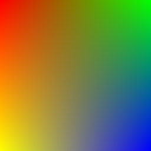
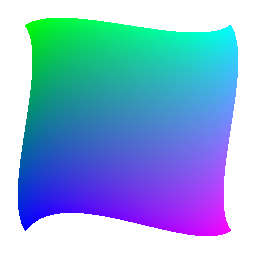
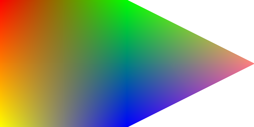
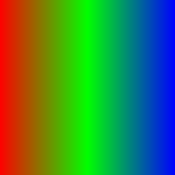

# pycairo

[pycairo](http://cairographics.org/pycairo/) is the Python binding of the vector-graphics library [cairo](http://cairographics.org/).

However, pycairo is limited to cairo 1.10, while cairo 1.12 has been released.
[This git repository](https://github.com/hydrargyrum/py2cairo) patches pycairo to support mesh gradients introduced in cairo 1.12.

# mesh gradients

Mesh gradients are more powerful than linear gradients. Actually, linear gradients can be emulated using just mesh gradients.

A mesh gradient consists of one or more gradients, which can be arranged in a mesh. Each of those gradients (called "patches") is made of 4 corner points with a color associated to each corner and the 4 corners are arranged in a closed Bezier path (the shape can make use of line and cubic splines).

## mesh gradient with 1 square patch

	pat = cairo.MeshGradient()
	pat.begin_patch()
	pat.move_to(0, 0)
	pat.line_to(1, 0)
	pat.line_to(1, 1)
	pat.line_to(0, 1)
	pat.set_corner_color_rgb(0, 1, 0, 0)
	pat.set_corner_color_rgb(1, 0, 1, 0)
	pat.set_corner_color_rgb(2, 0, 0, 1)
	pat.set_corner_color_rgb(3, 1, 1, 0)
	pat.end_patch()

	ctx.set_source(pat)
	ctx.rectangle(0, 0, 1, 1)
	ctx.fill()

## mesh gradient with 1 4-points cubic spline patch

	pat = cairo.MeshGradient()
	pat.begin_patch()
	pat.move_to(0.1, 0.1)
	pat.curve_to(0.25, 0, 0.75, 0.2, 0.9, 0.1)
	pat.curve_to(1, 0.25, 0.8, 0.75, 0.9, 0.9)
	pat.curve_to(0.75, 1, 0.25, 0.7, 0.1, 0.9)
	pat.curve_to(0, 0.75, 0.2, 0.25, 0.1, 0.1)
	pat.set_corner_color_rgb(0, 0, 1, 0)
	pat.set_corner_color_rgb(1, 0, 1, 1)
	pat.set_corner_color_rgb(2, 1, 0, 1)
	pat.set_corner_color_rgb(3, 0, 0, 1)
	pat.end_patch()

	ctx.set_source(pat)
	ctx.rectangle(0, 0, 1, 1)
	ctx.fill()

## mesh gradient with 1 rectangular patch and 1 triangular patch

	pat = cairo.MeshGradient()

	pat.begin_patch()
	pat.move_to(0, 0)
	pat.line_to(1, 0)
	pat.line_to(1, 1)
	pat.line_to(0, 1)
	pat.set_corner_color_rgb(0, 1, 0, 0)
	pat.set_corner_color_rgb(1, 0, 1, 0)
	pat.set_corner_color_rgb(2, 0, 0, 1)
	pat.set_corner_color_rgb(3, 1, 1, 0)
	pat.end_patch()

	pat.begin_patch()
	pat.move_to(1, 0)
	pat.line_to(2, 0.5)
	pat.line_to(1, 1)
	pat.set_corner_color_rgb(0, 0, 1, 0)
	pat.set_corner_color_rgb(1, 1, 0.5, 0.5)
	pat.set_corner_color_rgb(2, 0, 0, 1)
	pat.end_patch()

	ctx.set_source(pat)
	ctx.rectangle(0, 0, 2, 1)
	ctx.fill()

## linear gradient made with a mesh gradient

	pat = cairo.MeshGradient()

	pat.begin_patch()
	pat.move_to(0, 0)
	pat.line_to(0.5, 0)
	pat.line_to(0.5, 1)
	pat.line_to(0, 1)
	pat.set_corner_color_rgb(0, 1, 0, 0)
	pat.set_corner_color_rgb(1, 0, 1, 0)
	pat.set_corner_color_rgb(2, 0, 1, 0)
	pat.set_corner_color_rgb(3, 1, 0, 0)
	pat.end_patch()

	pat.begin_patch()
	pat.move_to(0.5, 0)
	pat.line_to(1, 0)
	pat.line_to(1, 1)
	pat.line_to(0.5, 1)
	pat.set_corner_color_rgb(0, 0, 1, 0)
	pat.set_corner_color_rgb(1, 0, 0, 1)
	pat.set_corner_color_rgb(2, 0, 0, 1)
	pat.set_corner_color_rgb(3, 0, 1, 0)
	pat.end_patch()

	ctx.set_source(pat)
	ctx.rectangle(0, 0, 1, 1)
	ctx.fill()

code for the linear gradient:

	pat = cairo.LinearGradient(0, 0, 1, 0)
	pat.add_color_stop_rgb(0, 1, 0, 0)
	pat.add_color_stop_rgb(0.5, 0, 1, 0)
	pat.add_color_stop_rgb(1, 0, 0, 1)

	ctx.set_source(pat)
	ctx.rectangle(0, 0, 1, 1)
	ctx.fill()
